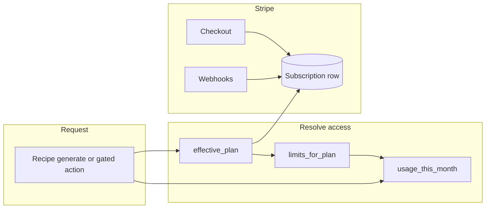

# Account features (tiers, usage, Stripe) — self-guided guide

Self-guided capstone track: you implement three-tier accounts (Visitor / Regular / Premium), monthly recipe quotas with a visible counter, and Stripe subscriptions in EUR. Anonymous and logged-in free users share Visitor limits (session + user, **merge on login**). Use this file as your checklist; ask the AI for hints or code review when stuck.

**Checklist (high level)**

- [ ] Phase A — Django app and models (`CustomerSubscription`, `RecipeUsageMonth`)
- [ ] Phase B — Quota logic + merge on login
- [ ] Phase C — Stripe Dashboard (products/prices in EUR)
- [ ] Phase D — Checkout, webhooks, Customer Portal
- [ ] Phase E — `/pricing/` + account settings UI
- [ ] Phase F — Hook recipe generation when Gemini view exists
- [ ] Phase G — Favorites, local save, PDF, video gates

---

## How to use this guide

Work **top to bottom**. After each phase, run `python manage.py check`, your migrations, and a quick manual test before moving on. When you are stuck, paste **errors, file paths, and the code you tried** into chat and ask for a hint—not a full rewrite.

**Suggested rhythm:** one git commit per phase (or per sub-step) so you can bisect mistakes.

---

## Self-guided walkthrough

### Phase A — Django app and models

1. **Create an app** (name it `billing` or `subscriptions`): `python manage.py startapp billing`.
2. **Register the app** in `INSTALLED_APPS` in `core/settings.py`.
3. **Define `CustomerSubscription`** (OneToOne to `User`):
   - Stripe fields you will need: `stripe_customer_id`, `stripe_subscription_id` (nullable until first checkout).
   - Business fields: `status` (choices mirroring Stripe’s subscription status or a simplified `active` / `past_due` / `canceled`), `plan` (`regular` | `premium`), optional `billing_interval` (`month` | `year`), `current_period_end` (DateTimeField, null=True).
   - Use `get_or_create` in views/webhooks so you never assume the row exists.
4. **Define `RecipeUsageMonth`**:
   - `year_month` as a `CharField(7)` (`YYYY-MM`) or a `DateField` storing first-of-month—pick one and stick to it.
   - `count` = positive integer, default 0.
   - **Either** `user` (FK, null=True) **or** `session_key` (CharField, null=True, db_index=True)—not both set on the same row; enforce with a `CheckConstraint` in `Meta.constraints`, and a `UniqueConstraint` on `(year_month, user)` where user is not null, plus `(year_month, session_key)` where session_key is not null. (Django 4.2+ conditional unique constraints use `UniqueConstraint(..., condition=Q(...))`.)
5. **`makemigrations` / `migrate`.**
6. **Register both models in `admin.py`** so you can inspect rows during debugging.

**Verify:** Admin shows empty tables; no migration errors.

**Pitfall:** Forgetting partial unique constraints—without them you can duplicate usage rows and break counting.

---

### Phase B — Quota logic (no Stripe yet)

1. **Add a small module** e.g. `billing/services.py` (or `quota.py`) with pure functions:
   - `current_year_month()` → string or date for “this month.”
   - `recipe_quota_for_plan(plan)` → `2`, `10`, or `None` (meaning unlimited for premium).
   - `effective_plan(user)` → if user is authenticated and `CustomerSubscription` says active paid plan, return `regular` or `premium`; else return `visitor`. For **anonymous** requests, plan is always `visitor` for quota purposes (paid features still require login + subscription).
2. **Usage helpers** (use `transaction.atomic` + `select_for_update` when incrementing to avoid race conditions under concurrent requests):
   - `get_or_create_usage_row(request)` — if `request.user.is_authenticated`, key off `user_id`; else key off `request.session.session_key` (ensure `SessionMiddleware` has run so the session exists—call `request.session.save()` early in the flow if you generate before first session write).
   - `usage_remaining(request)` — compute `quota - count` or “unlimited.”
   - `consume_recipe_generation(request)` — if no quota left, return `False` or raise a custom exception; else increment `count` and return `True`.
3. **Merge on login** — after a successful login in `users/views.py` `login_view` (and social login if you use allauth—use `user_logged_in` signal), find `RecipeUsageMonth` for the current month with this `session_key`, add its `count` to the user’s row for that month, delete the session row.

**Verify:** In Django shell, simulate two increments for anonymous session, then log in and confirm one user row holds the merged total.

**Pitfall:** Quota checks only in JavaScript—always enforce on the **server** before calling Gemini.

---

### Phase C — Stripe Dashboard prep (no code)

1. Create a **Stripe account** (test mode is fine until you want live charges).
2. Create **Products** and **Prices** in EUR:
   - Regular: recurring **monthly** **1.99 EUR**.
   - Premium: recurring **monthly** **4.99 EUR**.
   - Premium yearly: recurring **yearly** **35.88 EUR** (12 × 2.99).
3. Copy the **Price IDs** (`price_...`) into `.env` (never commit secrets).

**Verify:** You see three price IDs in Dashboard → Products.

---

### Phase D — Stripe in Django

1. Add **`stripe`** to `requirements.txt`, install, set `STRIPE_SECRET_KEY` and later `STRIPE_WEBHOOK_SECRET` in settings from env.
2. **Checkout Session view** (`@login_required`):
   - Accept POST or GET with a **price id** (validate it against an allowlist of your three env price IDs—do not trust raw client input).
   - Call `stripe.checkout.Session.create` with `mode="subscription"`, `line_items=[{"price": allowed_id, "quantity": 1}]`, `success_url`, `cancel_url`, `client_reference_id` or `metadata` including `user_id`.
   - Redirect to `session.url`.
3. **Webhook view**:
   - New URL, **`csrf_exempt`**, POST only.
   - Read raw body; `stripe.Webhook.construct_event(payload, sig_header, webhook_secret)`.
   - Handle at minimum: `checkout.session.completed` (link Stripe customer + subscription to your user via metadata), `customer.subscription.updated`, `customer.subscription.deleted`.
   - Map **subscription item price id** → `plan` + `billing_interval` and update `CustomerSubscription`.
4. **Customer Portal**: endpoint that creates `stripe.billing_portal.Session` with `customer` id and returns redirect URL for “Manage subscription.”

**Local testing:** Install [Stripe CLI](https://stripe.com/docs/stripe-cli), run `stripe listen --forward-to localhost:8000/your/webhook/path`, trigger test checkout, watch events.

**Pitfall:** Using `@csrf_exempt` without signature verification—anyone could POST fake events.

---

### Phase E — UI: pricing + account

1. **Route `/pricing/`** — add path in `pages/urls.py`, view in `pages/views.py`, template describing the three tiers; buttons for Regular/Premium post to your Checkout view (only if logged in—otherwise link to register/login with `?next=/pricing/`).
2. **Account settings** — extend `templates/users/account_settings.html` via context from `account_settings` view: show **plan name**, **usage** `used / limit` or “Unlimited,” **renewal date** if subscribed, links **Subscribe** / **Manage billing**.

**Verify:** Logged-out `/pricing/` works; logged-in user can start Checkout (test card `4242…`); webhook updates `CustomerSubscription`; account page reflects plan.

---

### Phase F — Hook recipe generation (when you build it)

1. Identify the **single view or API** that will call Gemini.
2. **Before** the AI call: `if not consume_recipe_generation(request):` return 402/403 or a friendly message with remaining quota.
3. **Template/context:** pass `usage_remaining` into pantry/recipe templates for the **counter** (Visitor + Regular).

---

### Phase G — Later feature gates

- **Favorites:** model + views; deny Visitor at view level.
- **localStorage “saved recipes”:** front-end only for Regular+ (hide button for Visitor).
- **PDF / video:** separate views checking `effective_plan(request.user) == premium`.

---

### Study order (docs)

- Django: [Constraints](https://docs.djangoproject.com/en/stable/ref/models/constraints/), [Signals](https://docs.djangoproject.com/en/stable/topics/signals/) (optional for merge-on-login).
- Stripe: [Checkout subscription mode](https://stripe.com/docs/payments/checkout/subscriptions), [Webhooks](https://stripe.com/docs/webhooks), [Customer Portal](https://stripe.com/docs/customer-management/portal).

---

## Current codebase snapshot

- Auth lives in `users/views.py` with `users/models.py` `UserProfile` (skill level only). Account UI: `templates/users/account_settings.html`.
- No subscription, usage, favorites, PDF, or video code. `recipes/views.py` is empty; `GEMINI_API_KEY` exists in `core/settings.py` but nothing calls Gemini yet.
- Navbar links to `/pricing/` (`templates/base.html`) but `pages/urls.py` only serves `/` — pricing will 404 until routed.

## Target behavior (from spec + your choices)

| Tier | Price | Recipe quota / month | Other |
|------|--------|-------------------------|--------|
| Visitor (free) | — | **2** | Counter visible |
| Regular | **1.99€** / month (Stripe, auto-renew) | **10** | Save recipes locally, favorites |
| Premium | **4.99€** / month or **2.99€**/mo equivalent on **yearly** plan | **Unlimited** | PDF download, unlimited prep videos, favorites |

- **Visitor scope:** both anonymous users and logged-in users **without** an active paid subscription use Visitor limits until Stripe marks them Regular or Premium. Track anonymous usage via **Django session** (`session_key`); track logged-in usage via **user id**. On login, **merge** any anonymous counts for the current calendar month into the user’s row.

## Architecture

1. **`effective_plan(user, session)`** returns `visitor` | `regular` | `premium` from DB-backed subscription state (Stripe is source of truth; local model is cache for fast checks and webhook handling).
2. **`recipe_quota(plan)`** returns `2`, `10`, or `None` (unlimited).
3. **`consume_recipe_generation(request)`** (transactional): if over quota, raise/return error; else increment monthly counter. Call this from the **single** backend entry point that will invoke Gemini when you build it.

## Data model (summary)

- **`CustomerSubscription`** (OneToOne to `User`): `stripe_customer_id`, `stripe_subscription_id`, `status`, `plan` (`regular` | `premium`), `billing_interval` (`month` | `year` for premium yearly), `current_period_end`. Sync from webhooks; do not trust the client.
- **`RecipeUsageMonth`**: `year_month`, `count`, and either `user` or `session_key` with constraints as in Phase A. Merge-on-login: add session row’s `count` to the user’s row, delete the session row.

## Stripe (real subscriptions, EUR) — summary

- **Price IDs** in env: e.g. `STRIPE_PRICE_REGULAR_MONTHLY`, `STRIPE_PRICE_PREMIUM_MONTHLY`, `STRIPE_PRICE_PREMIUM_YEARLY`.
- Checkout (login required), webhooks with signature verification, Customer Portal for cancel/update payment.

**Env:** `STRIPE_SECRET_KEY`, `STRIPE_WEBHOOK_SECRET`, price IDs, publishable key if needed.

## Testing and safety

- Unit tests: quota math, month rollover, merge-on-login, plan resolution from mocked webhook payloads.
- Stripe **CLI** for local webhook forwarding.

## Implementation order (short)

1. Models + migrations + `effective_plan` / quota / increment + merge-on-login.
2. Stripe Checkout + webhook + portal + sync logic.
3. Pricing page route + account settings UI.
4. Wire recipe generation to `consume_recipe_generation` when it exists.
5. Favorites / PDF / video gates as those UIs land.
